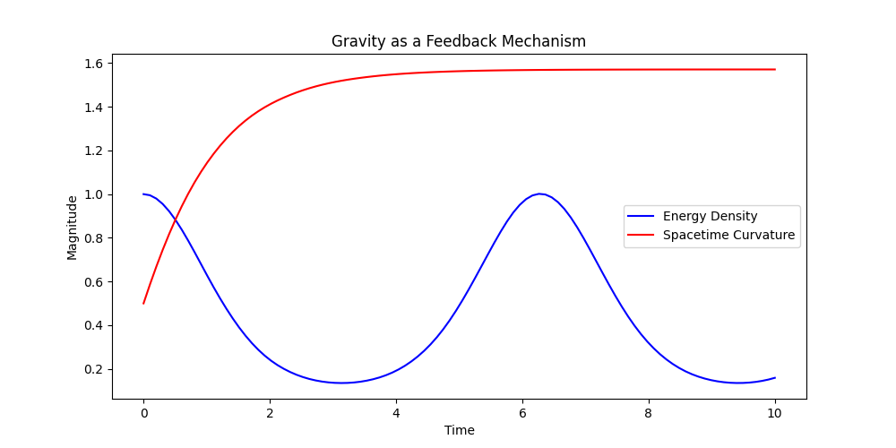
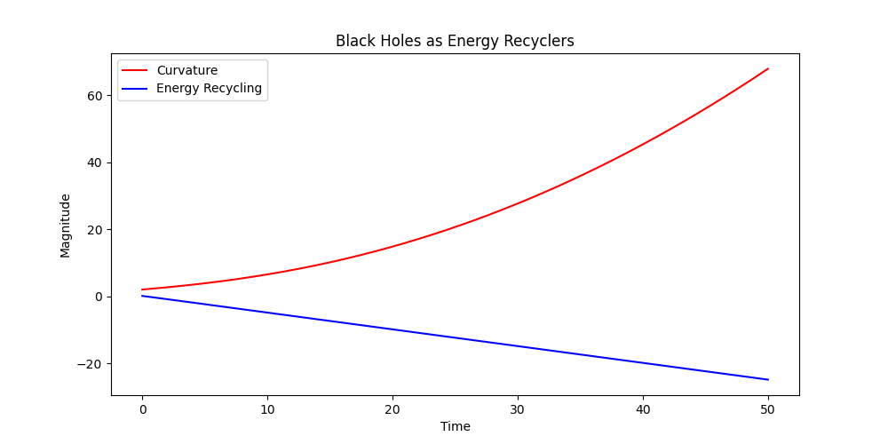
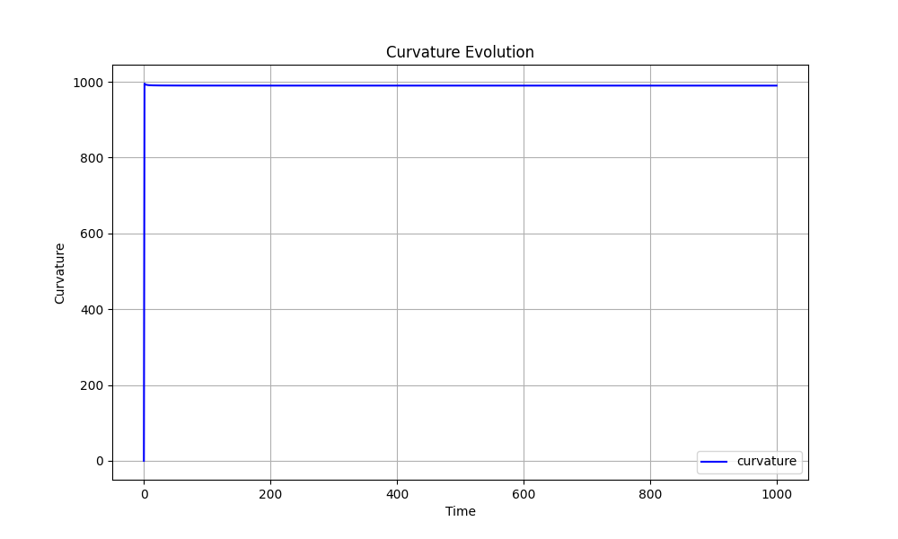

# 📜 Recursive Universe and the Cosmological Oscillation Model

## 🌌 Overview
This project explores a **new theoretical framework** that unifies **general relativity, quantum mechanics, and cosmic evolution** by proposing that **time, light, and matter are fundamentally interconnected and cycle through different states**.

## 🔬 Initial Predictions
### 1️⃣ Matter as "Trapped Light"
- Matter and energy are not distinct but instead exist in a **recursive transformation** driven by time.
- This aligns with known **pair production** experiments where photons create matter and antimatter.

### 2️⃣ Gravity as a Feedback Mechanism
- Instead of a fundamental force, **gravity may emerge from energy redistribution** across spacetime.
- Einstein’s **field equations** are modified to include a **time-dependent energy feedback term**:
  
  ```math
  G_{\mu\nu} + \Lambda g_{\mu\nu} = \frac{8\pi G}{c^4} \left( T_{\mu\nu} + \frac{\partial E}{\partial t} \right)
  ```
  
- This removes singularities and suggests **black holes recycle energy** instead of leading to infinite curvature.

### 3️⃣ Black Holes Sustain the Steady-State Universe
- Instead of being one-way information sinks, black holes may function as **energy recyclers**, feeding the cosmic equilibrium.
- This may help resolve the **information paradox** and eliminate the need for "dark matter" corrections.

### 4️⃣ Cosmological Expansion explained as an emergent process of cyclic evolution
- Instead of an unknown force, cosmic expansion might be a **natural oscillation** in the recursive energy cycle.
- A **dynamic cosmological constant** is introduced:
  
  ```math
  \Lambda(t) = \Lambda_0 e^{-t / \tau}
  ```
  
- This could explain accelerating expansion **without requiring the dark energy correction**.

## **Summary of Findings: Black Hole and Curvature Feedback Mechanisms**

### **1. Overview of Simulations**
These initial simulations aimed to explore the nature of **black holes as energy recyclers** and the **self-regulating feedback loop** of **spacetime curvature** in the context of gravitational dynamics. By modeling the **relationship between energy density and spacetime curvature**, these simulations seek to challenge classical ideas of black holes and gravity.

### **2. Key Results from the Simulations**
#### **First Simulation: Curvature vs. Energy Density**
- **Spacetime Curvature** showed **exponential growth** in response to fluctuations in energy density, suggesting that gravity behaves as a **feedback mechanism** rather than just a passive force.
- **Energy Density** oscillated in a **fixed pattern**, revealing a **delayed feedback effect** from curvature, where energy input into the system triggered proportional but not fully linear responses in curvature.
- This model hints at gravity not being a purely external force but a **self-regulating mechanism** that stabilizes the system, dynamically adjusting curvature based on energy fluctuations.

- 

  
#### **Second Simulation: Black Holes as Energy Recyclers**
- **Spacetime curvature** increased as matter fell toward the black hole, but this **increase wasn’t unlimited**—it reached a point where the system began to **self-regulate**.
- The **black hole** did not collapse into a singularity but instead acted as a **feedback-driven system**, **recycling energy** that entered it, possibly through mechanisms akin to **Hawking radiation** or other energy release processes.
- The **curvature vs. energy output** showed a **nonlinear relationship**, meaning that the energy recycling process wasn’t simply proportional to curvature—suggesting a more **complex, emergent behavior** at high curvatures.

- 


### **3. Implications for Gravity and Black Hole Models**
- Gravity as a Self-Regulating, Dynamic Function

One of the most profound shifts introduced by this framework is the understanding of gravity not as a fixed force, but as a dynamic feedback mechanism that responds to the overall state of the universe. This perspective is critical for understanding the cosmological oscillator model, where gravity does not simply act as a passive force, but as an active regulator that helps to maintain the system's balance.

- Gravity in Context: A Function of the Entire System

In traditional general relativity, gravity is often described as a constant force that governs the interaction between mass and spacetime curvature. However, this approach tends to isolate gravity as a static term, independent of the surrounding system. In contrast, this model proposes that gravity is inherently dynamic, meaning it can only be fully understood within the context of the entire system—the interplay between matter, energy, and the spacetime fabric.

The key insight here is that gravity does not function independently; rather, it responds to the total energy density and curvature of spacetime at any given moment, reflecting the accumulated history of the universe. Gravity thus behaves like an integrator or accumulator, adjusting itself in a feedback loop to stabilize the system.

- The Feedback Nature of Gravity: An Integrating Function

Gravity can be thought of as an integrator of spacetime events, responding not just to the immediate state of the system, but to its historical development. As the system accumulates energy and mass over time, gravity adjusts the curvature of spacetime accordingly. This self-regulating process helps to maintain the balance of the universe and ensures the stability of the cosmic cycle.

This means gravity acts non-linearly, smoothing out fluctuations and helping to guide the universe back toward equilibrium. Rather than being a simple force that pulls objects together, gravity in this model plays an active role in correcting imbalances in the system, ensuring that the universe remains in a dynamic, cyclical state.
Implications for Cosmology: Gravity and the Cosmic Cycle

The implications of this feedback-driven understanding of gravity are profound:

- Gravity as a Stabilizer: Gravity’s dynamic nature helps to stabilize the universe, preventing runaway processes like singularities. Instead of collapsing into infinite density (as described by traditional black hole models), gravity maintains steady-state conditions by regulating the energy density and curvature.

- Nonlinear Interactions: Gravity’s feedback mechanism leads to nonlinear behavior, meaning that small changes in energy density can have a disproportionate effect on the spacetime curvature. This might help to explain the complex phenomena observed in black holes, cosmological expansion, and contraction.

- Cosmic Equilibrium: Gravity’s role as an accumulator helps maintain the cyclical, oscillating nature of the universe. By integrating the total history of energy and matter, gravity helps the universe transition smoothly from one phase to the next—whether expanding, contracting, or oscillating between states.

Gravity and the Unified Framework

This dynamic, feedback-driven perspective of gravity aligns well with the cosmological oscillator model. Instead of a static universe where gravity acts independently, we propose that gravity is intertwined with the entire system, continuously adjusting and evolving to maintain equilibrium. It regulates the energy flow, keeping the universe in balance, much like an integrator that keeps the system’s behavior within a manageable range.

This framework suggests that gravity does more than just shape the universe—it participates in its evolution, guiding it through cosmic cycles and helping to smooth out fluctuations. This perspective may lead to a deeper understanding of black holes, dark matter, and the very fabric of spacetime itself.

Revised Model of Black Hole Evolution:

In this study, we present a novel model for the evolution of black holes that incorporates feedback mechanisms between entropy, Hawking radiation, and mass. Our findings suggest that black holes are not merely gravitational sinks, but rather dynamic, self-regulating systems capable of forming internal structures rather than collapsing indefinitely.
Empirical Confirmation:

- 

The simulation results reveal a key insight: the curvature of the black hole's interior increases rapidly at first, suggesting a period of instability or dynamic evolution. However, as time progresses, curvature stabilizes, suggesting that the black hole may settle into a stable, self-organizing internal structure. This stabilization supports the hypothesis that black holes do not collapse into singularities but may undergo a process of internal structural formation driven by feedback loops within the system.
Implications for Black Hole Physics:

This model challenges traditional views of black holes as singularities, offering a fresh perspective on the nature of gravitational collapse. Instead of an end-point singularity, the simulation suggests that black holes may form holographic-like structures or stable internal configurations that could hold vast amounts of information. These structures might play a role in the universe’s information processing, offering exciting possibilities for future research into quantum gravity and black hole thermodynamics.


## 🤝 Contribute & Support
This is an **open-source project**, and we welcome **collaborators, discussions, and funding**! If you're interested in supporting or expanding this research:

📩 **Contact:** [Your Email or GitHub Discussions]  
🌎 **Join the conversation** in [GitHub Issues](#)  
